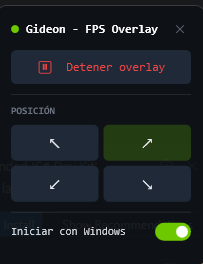

<div align="center">

# Gideon - FPS Overlay

**Overlay ultraligero de FPS para Windows.**
Sin inyecciones. Sin anti-cheat issues. Sin consumo perceptible de recursos.

[](LICENSE)
[](https://github.com/tu-usuario/gideon/releases/latest)
[](https://dotnet.microsoft.com)
[](https://github.com/tu-usuario/gideon/releases/latest)

[**Descargar**](https://github.com/tu-usuario/gideon/releases/latest) - [**Sitio web**](https://tu-usuario.github.io/gideon) - [**Reportar bug**](https://github.com/tu-usuario/gideon/issues)

</div>

---

## Vista previa

<div align="center">

</div>

## Que es Gideon?

Gideon muestra los FPS del juego en primer plano directamente sobre tu pantalla, en la esquina que elijas, en tiempo real. Es un contador minimalista: solo el numero, con color que indica el rendimiento, sin fondos ni widgets que distraigan.

> Inspirado en **Gideon Ofnir, "El Omnisciente"** de Elden Ring: un personaje cuya unica funcion es recopilar y monitorear informacion de todo lo que ocurre en el mundo, de forma silenciosa y sin intervenir.

---

## Caracteristicas

- **Overlay limpio**: solo el numero, sin caja ni fondo. Se funde con cualquier juego.
- **Color dinamico**: verde mayor o igual a 60 FPS, amarillo 30-59, rojo menor a 30.
- **Anti-cheat safe**: usa ETW (Event Tracing for Windows), pasivo, sin inyeccion de codigo ni hooks del swapchain. Compatible con Vanguard, Easy Anti-Cheat y BattlEye.
- **Todas las GPUs**: Intel, AMD y NVIDIA. Los eventos Present los emite Windows, no el driver.
- **Click-through**: el overlay no interfiere con el mouse ni con el juego.
- **Bandeja del sistema**: vive en el tray, no ocupa espacio en la barra de tareas.
- **4 esquinas configurables**: elige donde queres ver el contador. Se recuerda entre sesiones.
- **Iniciar con Windows**: opcion integrada en el panel de control, sin ventana UAC en el arranque.
- **Ligero**: WPF + Win32 directo. Pocos MB de RAM, 0% CPU en reposo.

---

## Requisitos

| Requisito | Detalle |
|-----------|---------|
| Sistema operativo | Windows 10 / 11 (64-bit) |
| Runtime | [.NET 10](https://dotnet.microsoft.com/download/dotnet/10.0) o usa la version portable que incluye todo |
| Permisos | Administrador. Requerido por ETW. El UAC lo pide automaticamente al abrir. |
| Modo de pantalla | Borderless / ventana. La pantalla completa exclusiva no es compatible en v1. |

---

## Instalacion

### Opcion A - Descarga directa (recomendado)

1. Ve a [**Releases**](https://github.com/tu-usuario/gideon/releases/latest).
2. Descarga `Gideon.exe`.
3. Ejecuta como administrador.

No requiere instalador ni dependencias adicionales.

### Opcion B - Compilar desde codigo fuente

```powershell
git clone https://github.com/tu-usuario/gideon.git
cd gideon
dotnet build -c Release
.\bin\Release\net10.0-windows\Gideon.exe
```

Para generar un unico `.exe` portatil sin necesidad de .NET instalado:

```powershell
dotnet publish -c Release -r win-x64 --self-contained true -p:PublishSingleFile=true
```

---

## Uso

Al iniciar, Gideon se instala en la **bandeja del sistema** (el area junto al reloj).
El overlay aparece en la esquina superior derecha por defecto.

### Panel de control

Haz click en el icono del tray para abrir el panel:

| Control | Funcion |
|---------|---------|
| Iniciar / Detener | Muestra u oculta el overlay (se persiste) |
| Arr. Izq. / Arr. Der. / Ab. Izq. / Ab. Der. | Mueve el overlay a la esquina elegida (se persiste) |
| Iniciar con Windows | Toggle para arranque automatico sin ventana UAC |
| X | Cierra Gideon completamente |

Click derecho sobre el icono para salir.

### Atajos de teclado (globales)

| Atajo | Accion |
|-------|--------|
| `Ctrl + Alt + F` | Mostrar / ocultar overlay |
| `Ctrl + Alt + Q` | Salir |

---

## Como funciona

Gideon lee los FPS de forma **pasiva** mediante **ETW (Event Tracing for Windows)**, a traves del wrapper [PresentMonFps](https://github.com/lemutec/PresentMonFps). Cuenta los eventos `Present` que Windows/DXGI emite cada vez que un juego entrega un frame a la pantalla.

No hay inyeccion de codigo. No se toca el proceso del juego. No se instalan drivers. Los anti-cheats no lo detectan como amenaza porque opera exactamente igual que las herramientas de diagnostico del propio Windows.

---

## Estructura del proyecto

```
Gideon.csproj
GlobalUsings.cs                    Aliases: evita ambiguedad WPF + WinForms
App.xaml / App.xaml.cs             Arranque, tray icon, orquestacion
TrayPopup.xaml / TrayPopup.xaml.cs Panel de control
OverlayWindow.xaml / .cs           Ventana transparente click-through
Models/Corner.cs                   Enum de esquinas
Services/FpsService.cs             Medicion de FPS via PresentMonFps (ETW)
Services/ForegroundService.cs      Detecta el PID del juego en primer plano
Services/SettingsService.cs        Persistencia de configuracion (JSON)
Services/StartupService.cs         Arranque con Windows via Task Scheduler
Interop/NativeMethods.cs           P/Invoke: estilos Win32, hotkeys, foreground
app.manifest                       requireAdministrator + PerMonitorV2 DPI
```

---

## Limitaciones conocidas (v1)

- **Pantalla completa exclusiva**: el overlay no se renderiza encima. La mayoria de juegos modernos usan borderless por defecto.
- **Solo FPS**: frametime, 1% low, framegen, temperatura y uso de GPU/CPU quedan para versiones futuras.

---

## Licencia

**MIT + Commons Clause** - ver [`LICENSE`](LICENSE).

Podes usar, modificar y distribuir Gideon libremente para uso **personal y no comercial**.
No esta permitido vender el software ni ofrecer servicios comerciales basados en el.

---

## Contribuciones

Issues y pull requests son bienvenidos. Si encontras un bug o queres proponer una feature, abri un [issue](https://github.com/tu-usuario/gideon/issues).
